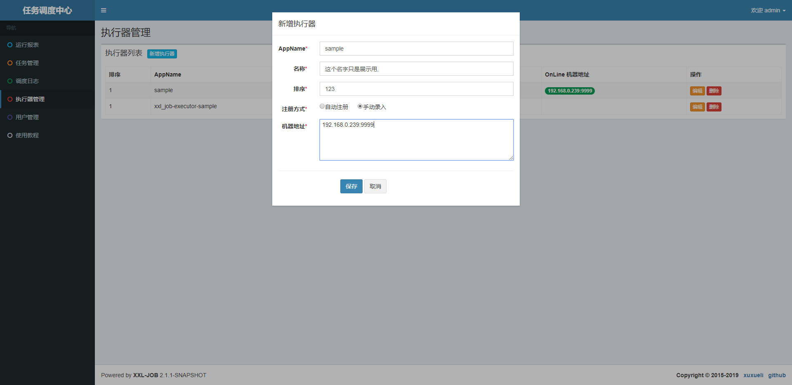

# 子服务任务调度(xxl-job)集成说明

## 加入Maven依赖

```xml
		<dependency>
			<groupId>com.hngd.commons</groupId>
			<artifactId>xxl-job-spring-boot-starter</artifactId>
			<version>0.0.1-SNAPSHOT</version>
		</dependency>
```

## 配置执行器

修改配置文件${项目根路径}/config/application.yml

```yml
xxl:
  job: 
    admin: 
      addresses: http://192.168.0.140:18889/xxl-job-admin
    executor:
      appName: ${spring.application.name}
      ip: 192.168.0.123 
      port: 9999
      log-path: ./logs
      log-retention-days: 15
    access-token: 
```

修改配置文件${项目根路径}/src/main/jib/config/application.yml

```yml
xxl:
  job: 
    admin: 
      addresses: ${XXL_JOB_ADMIN_SERVER}
    executor:
      appName: ${spring.application.name}
      ip:  
      port: ${XXL_JOB_EXECUTOR_PORT:9999}
      log-path: ./logs
      log-retention-days: 15
    access-token: 
```

## 编写具体的任务处理代码

编写一个类继承于com.xxl.job.core.handler.IJobHandler,加上注解@JobHandler

```java
@JobHandler("testJob")
@Slf4j
@Component
public class TestJob extends IJobHandler{

	@Override
	public ReturnT<String> execute(String param) throws Exception {
		log.info("exec param:{}",param);
		return ReturnT.SUCCESS;
	}
}
```

## 配置执行器与任务

 前往xxl-job-admin服务http://192.168.0.140:18889/xxl-job-admin,(用户名/密码:admin/123456)配置执行器,



配置任务


配置完后,尝试执行一次.并确认执行成功(**注意:执行前记得运行你的程序**)


